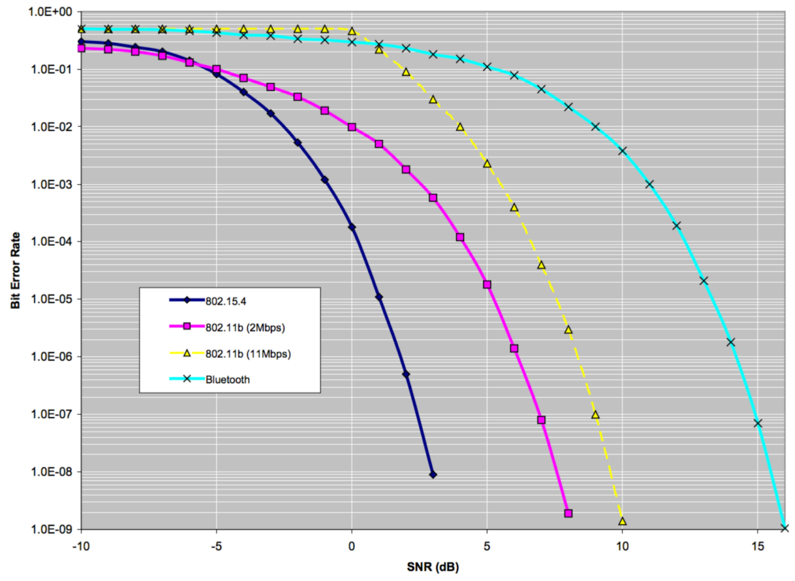

# Frequenz & Wellenlängen

| Name        | Zeichen           | Masseinheit  |
| ------------- |:-------------:| -----:|
| Frequenz       |  f | Hz = 1/s  |
| Wellenlänge    |  y | m         |
| Periodendauer  | T  | s         |

```
s = v * t
y = c * T
T = 1/f
c = y * f
```

ISM Frequenzen, können frei genutzt werden. z.B. 2.4 GHz oder 6.7 MHz. Andere Frequenzen müssten lizenziert werden. 

## "Wlan"

IEE 802.11 -> Home Wlan network

2400 --> 2480 MHz und 22 MHz Bandbreiten

IEE 802.15.4 -> Home control (IOT) Network

2405 --> 2480 MHz und 2 MHz Bandbreiten

## ZigBee

Zigbee based on 802.15.4 Network 

## Robustness

Bit error Rate by Signal to noise Ratio (dB)



Bluetooth for example has a very low Bit Error Rate however the SNR is very bad!