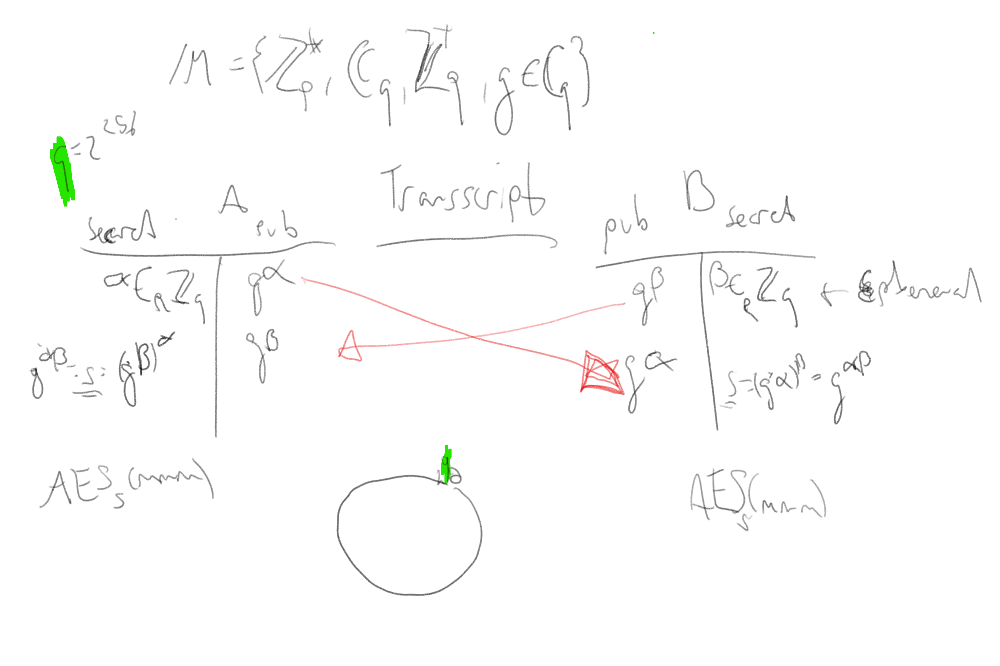
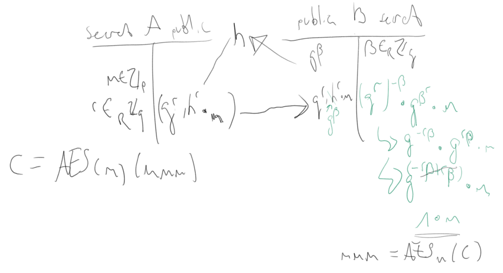

# Koenig

## 

Post mit Schloss von A zu B -> B schloss and Post und zurück, A nimmt schlüssel ab -> Zurück zu B, nimmt schloss ab. 

### Verschlüsselung von Ceasar (Rot 13)
Uryyb Obeyq -> Hello World

Rotation des Alphabets um 13 Stellen. -> *Alogrithmus (Rot 13)*

Wenn der Algorithmus verborgen bleiben muss nennt sich das Black Box Crypto

### One Time Pad (OTP)

Für Crypto braucht es Entropie

## Math

Potenz Gesetze:
- g^a * g^b = g^a+b
- (g^a)^b = g^a*b

## Kanal Verschlüsselung

## Security 
