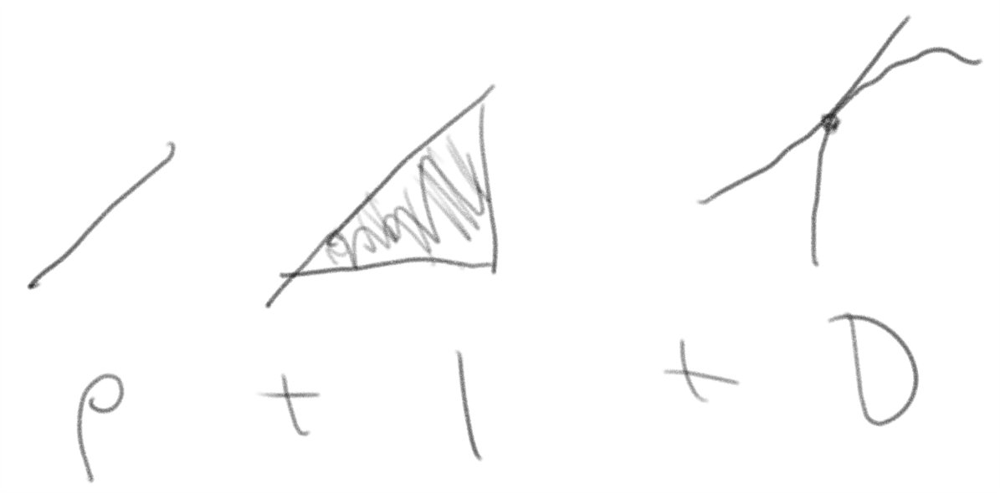
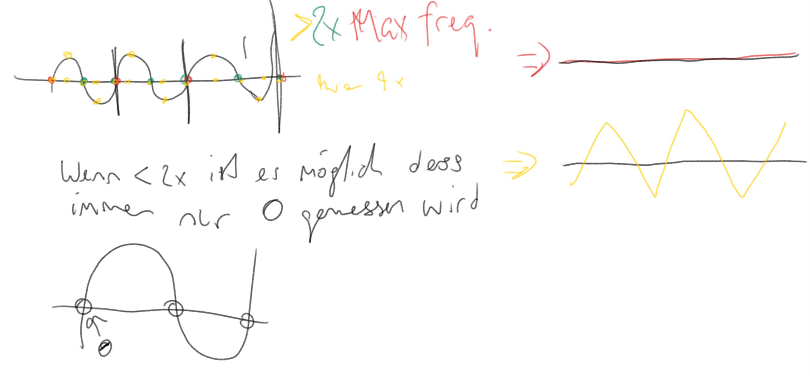

# Repetition

  - **P** Korrigiert richtung Linie (Proportional zur linie)
  - **D** Korrigiert schneller
  - **I** Fehler kompensieren 
    - Hier kann es zu einem Windup kommen, wenn Fehlergrösse > Korrigierebar 

# Vorlesung vom 12.10

Noumenon

"*Das Ding an und für sich*"

Das Ding kann vermessen werden, z.B. Temperatur, Licht usw. Dies sind dann Phänomene oder so.

## Domänen

 - Zeitdomäne
 - Frequenzdomäne
Von der Zeit in die Frequenzdomäne -> Fourier transformation

## 

Alias Funktionen gibt es unendlich viele -> bedeutet alle die das gleiche ergeben.

sin(delta T * pi)

Sampling and aliasing (frequenz)

