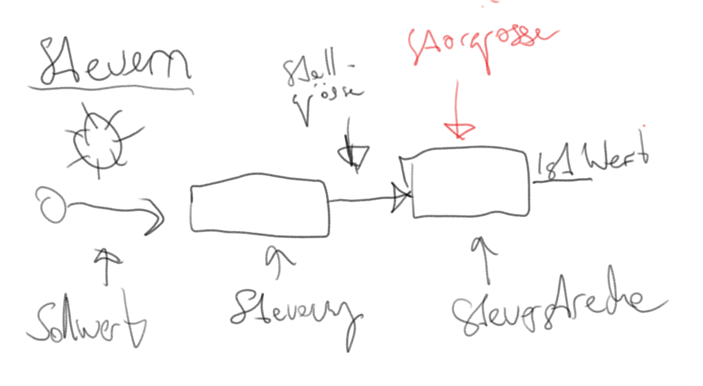
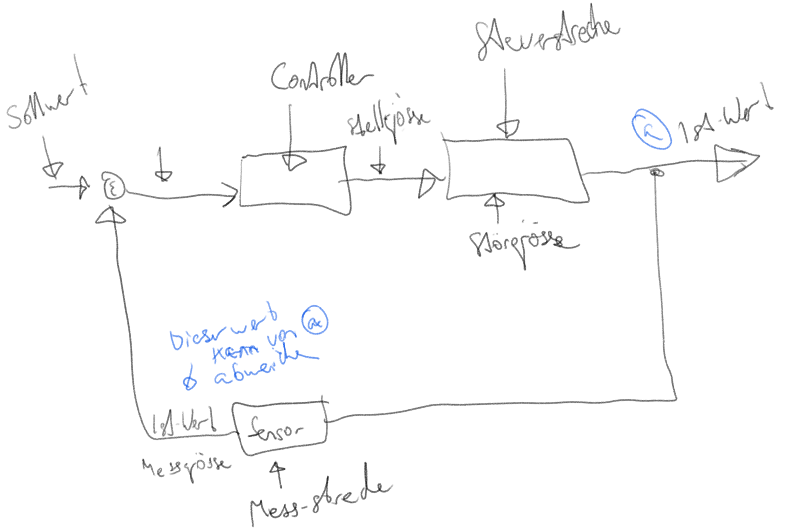

# Steuerung



# Regelung



## 2-Punkt regelung oder 3-Punkt regelung (alias BangBang)

Hier wird ein Ausgleich gemacht sobald ein wert überschritten wird.
Dies führt zu einer sehr ruckartigen fahrt beim Lichtsensorgefährt. Daher auch BangBang.

### Math
u(t) =>
  * If u(t-1) = 0 and b < error
  * If u(t-1) = 1 and b < error 
  * If error kleiner -> 0
  
Heisst entweder x grad rechts oder x grad links steuerung

## Proportional Control (PID Control)
Angepasster steering angle

### Proportionaler Teil
Wenn weiter weg, mehr korrigieren.
Mit nur P, kann ein überschiessen des Ziels geschehen. Sehr weit von strecke P wird immer grösser, d.H. Steuerung immer extremer. 
```
y = Kp * e
```

### Integraler Teil
```
esum = esum + e
y = Ki * Ta * esum
```
esum -> Summe der Errors
Ta -> Abtastzeit

### Differentialer Teil
```
y = Kd * (e -ealt) / Ta
ealt = a
```
ealt -> alter Fehler
