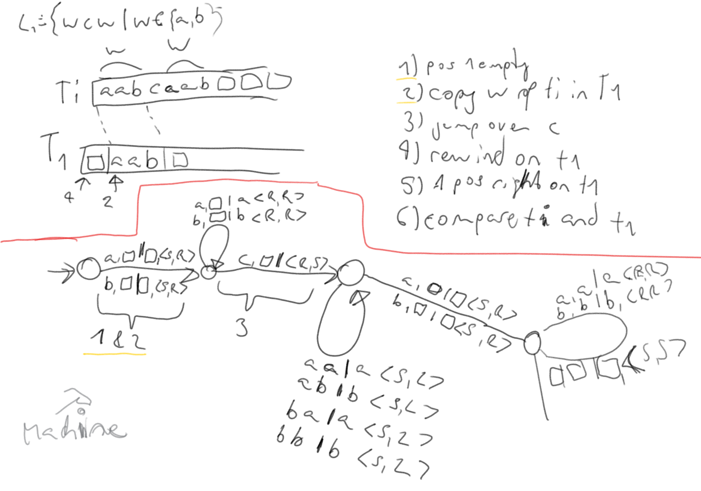
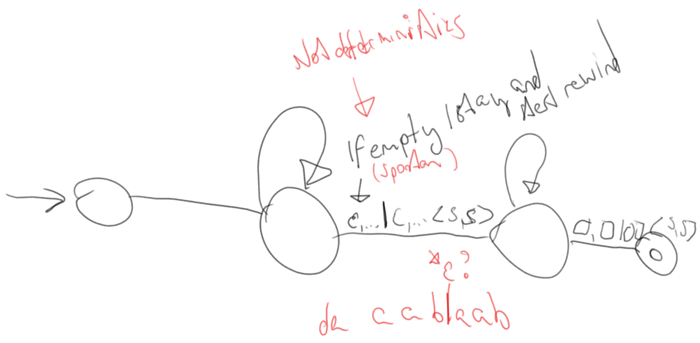
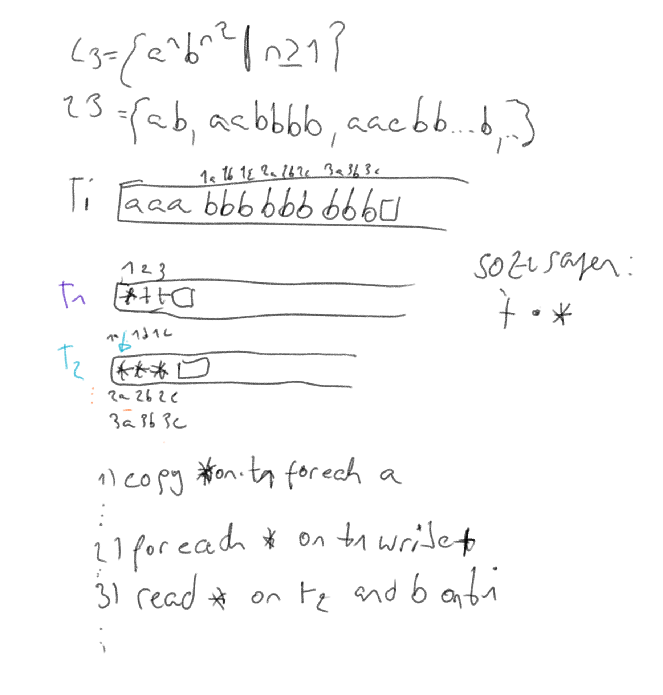
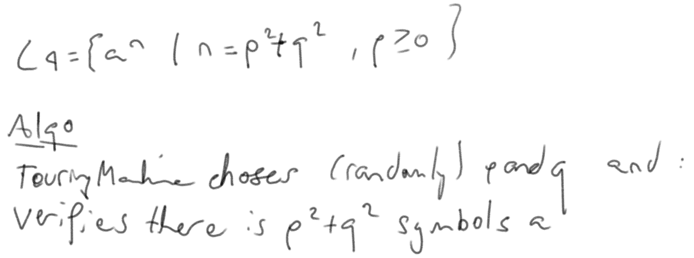

# [Serie 0](./serie0.pdf)

## Ex 1 
Lang = {a,b,c}

L1 = { wcw | w e {a,b}+},

L1 = {aabcaab, aca, aaaa, ...}

Means -> Word, *the letter C*, same word again 

L2 = { ww | w e{a,b}}

hier ist e ein "spontan" Zustand, das heisst die Maschine ist nicht deterministisch.

L3 = { a^n b^n^2 | n >= 1}

hier werden 2 Tapes benötigt

L4 = {a^n | n = p^2 + q^2}

