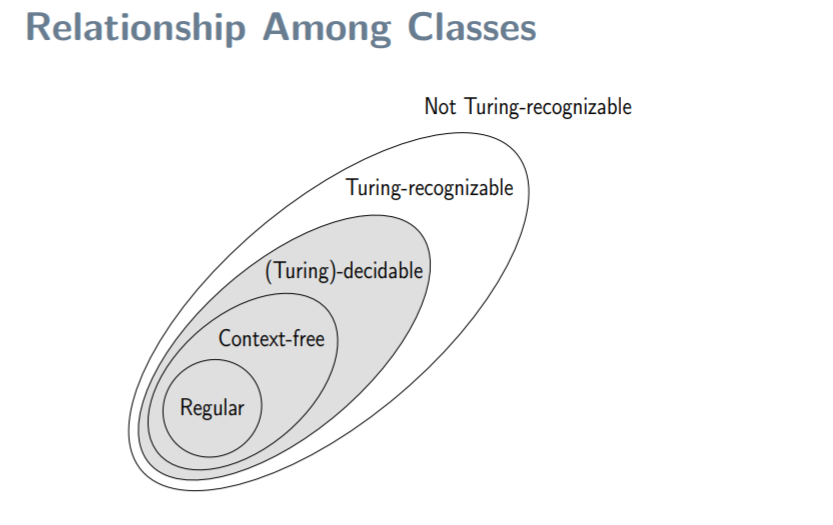

# Notes 02.10.2018

## Problem / Language

Entscheidungsprobleme -> Probleme wo es 2 Antworten gibt / Yes or No

Examples:
 * given a nautral number, is this number prime or not?
 * given a Java program P, does P always stop?

first problem we will find an answer, second problem we will not be able to find an answer.

Languag and problems are very close: 
* "is 2337 a prime number? "
  
  corresponds to: 
* decides if 2337 belongs to the set (or language of all prime numbers)

## Algorithm

An algorithm is a finite collection of basic instructions or operations that perform some tasks. 
An algorithm *always stops*

## Church-Turing Thesis

This thesis expresses the fact the the TMs is the most powerfull computational model. 

```
Intuitive notion of algorithms == Turing machine algorithms
```
