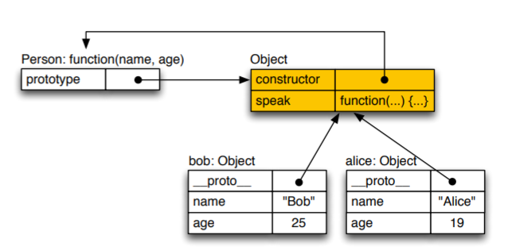
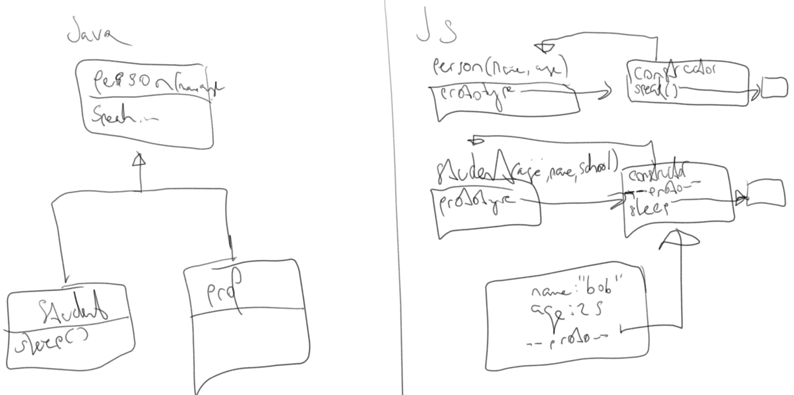

# Notes 01.10.2018

## Repetion
Constructor function
```
function Person(name, age){
  /...code.../
}
```
Returns a new empty object, whicht can be initialized with values as follows:
```
this.property = 22;
this.speak = function(phrase){
  console.log(phrase)
}
```
The function speak gets copied to the memory for new object. To improve memory, do the following:
```
function Person(name, age){
  /..code.../
}

Person.prototype.speak = function(phrase){
  console.log(phrase)
}
```


### [Excericse_02.js](../Exercises/Exercise_02.js)

### Prototypes and constructors



### [course05.js](../Courses/course05.js)
------
Ineritance

Der constructor is immer nicht enumarble, d.h. er kann in einem foreach über die keys nicht gefunden werden. 
Dies kann auch folgendermassen erzielt werden: 
```
Object.defineProperty(sub.prototype, 'constructor', {
    enumerable: false,
    value: function
  });

```

